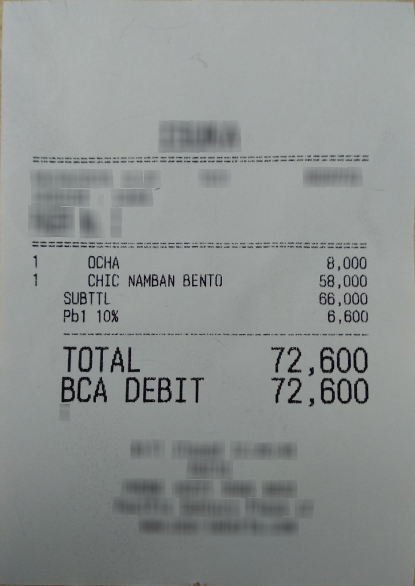
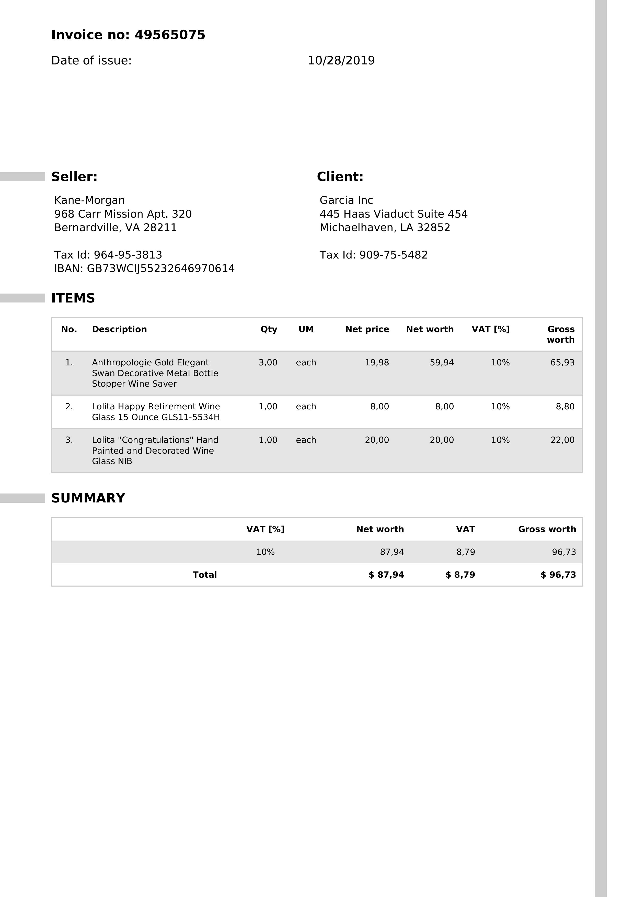
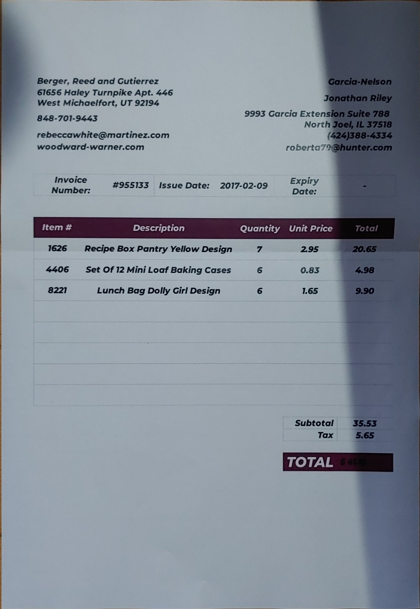
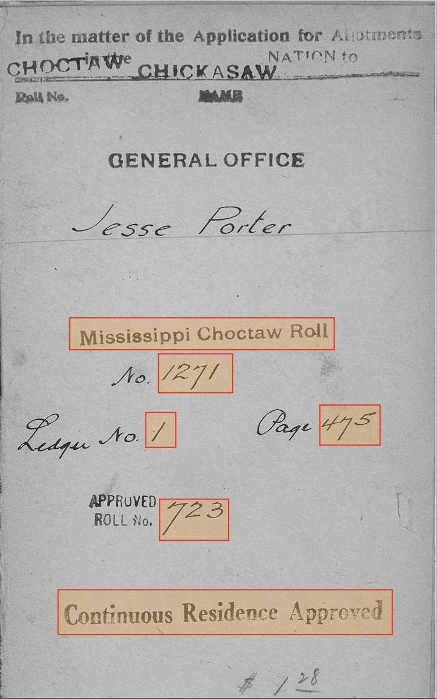

# OCR Module

The OCR Module is designed to extract text and information from document images using a variety of Optical Character Recognition (OCR) models. Each submodule caters to specific document types or use cases, providing flexibility and accuracy for text extraction tasks.

---

## Features
- **Support for Multiple OCR Models**: Includes Donut, Google Gemini, Tesseract, EasyOCR, and a custom Handwritten Digit Recognition (HDR) model.
- **Bounding Box Processing**: Text extraction within user-defined regions (Text Extractor).
- **Pretrained Models**: Automatically downloads pretrained models from Hugging Face or other sources as needed.

## Submodules

### 1. Receipt OCR (Donut)
Extracts structured data from receipt images using a pre-trained Donut model.  
Model: `naver-clova-ix/donut-base-finetuned-cord-v2` (downloaded automatically from Hugging Face).

#### Usage:
```python
from ocr import ReceiptOCRDonut
import json

# Initialize the Receipt OCR Donut
receipt_ocr = ReceiptOCRDonut(model_name="naver-clova-ix/donut-base-finetuned-cord-v2")

# Predict text from a receipt image
result = receipt_ocr.predict("path/to/receipt.jpg")

# Output structured information
json_data = json.dumps(result, indent=2)
print(json_data)
```
### Example Input:


### Output:    
```json
{
    "menu": [
        {
            "nm": "OCHA",
            "cnt": "1",
            "price": "8,000"
        },
        {
            "nm": "CHIC NAMBAN BENTO",
            "cnt": "1",
            "price": "58,000"
        }
    ],
    "sub_total": {
        "subtotal_price": "66,000",
        "tax_price": "6,600"
    },
    "total": {
        "total_price": "72,600",
        "creditcardprice": "72,600"
    }
}
```

---

### 2. Invoice OCR (Donut)
Extracts structured information from invoice images using a pre-trained Donut model.  
Model: `katanaml-org/invoices-donut-model-v1` (downloaded automatically from Hugging Face).

#### Usage:
```python
from ocr import InvoiceOCRDonut
import json

# Initialize the Invoice OCR Donut
invoice_ocr = InvoiceOCRDonut(model_name="katanaml-org/invoices-donut-model-v1")

# Process the input image
result = invoice_ocr.predict("path/to/invoice.jpg")

# Output structured data
json_data = json.dumps(result, indent=2)
print(json_data)
```
Noted: The invoice used is recommended to be in accordance with the model training data set. If different, you can use Google Gemini Extractor.

### Example Input:


### Output
```json
{
    "header": {
        "invoice_no": "49565075",
        "invoice_date": "10/28/2019",
        "seller": "Kane-Morgan 968 Carr Mission Apt. 320 Bernardville, VA 28211",
        "client": "Garcia Inc 445 Haas Viaduct Suite 454 Michaelhaven, LA 32852",
        "seller_tax_id": "964-95-3813",
        "client_tax_id": "909-75-5482",
        "iban": "GB73WCJ55232646970614"
    },
    "items": [
        {
            "item_desc": "Anthropologie Gold Elegant Swan Decorative Metal Bottle Stopper Wine Saver",
            "item_qty": "3,00",
            "item_net_price": "19,98",
            "item_net_worth": "59,94",
            "item_vat": "10%",
            "item_gross_worth": "65,93"
        },
        {
            "item_desc": "Lolita Happy Retirement Wine Glass 15 Ounce GLS11-5534H",
            "item_qty": "1,00",
            "item_net_price": "8,00",
            "item_net_worth": "8,00",
            "item_vat": "10%",
            "item_gross_worth": "8,80"
        },
        {
            "item_desc": "Lolita Congratulations\" Hand Painted and Decorated Wine Glass NIB",
            "item_qty": "1,00",
            "item_net_price": "20,00",
            "item_net_worth": "20,00",
            "item_vat": "10%",
            "item_gross_worth": "22,00"
        }
    ],
    "summary": {
        "total_net_worth": "$ 87,94",
        "total_vat": "$8,79",
        "total_gross_worth": "$96,73"
    }
}
```

---

### 3. Google Gemini Extractor
Uses Google Gemini AI to extract specific information from documents.

#### Prerequisite:
Ensure [Google Gemini API credentials](https://ai.google.dev/gemini-api/docs/api-key) are configured.   
You can copy the api key to the .env file

#### Usage:
```python
import os
from dotenv import load_dotenv
from ocr import GoogleGeminiExtractor
import json

# take environment variables from .env.
load_dotenv(dotenv_path=".env")
google_api_key = os.getenv("GOOGLE_API_KEY")

# Initialize the extractor
gemini_extractor = GoogleGeminiExtractor(google_api_key=google_api_key, 
                                         model='gemini-1.5-flash')

# Define the fields to be extracted (e.g., invoice image)
fields = {
    "invoice_number": None,
    "date": None,
    "due_date": None,
    "customer": {
        "name": None,
        "address": None,
        "phone": None,
        "email": None
    },
    "items": [],
    "totals": {
        "total_amount": None,
        "tax": None,
        "grand_total": None
    }
} 


# Process the input image
document_data = gemini_extractor.extract_information('path/to/file.jpg', fields)

# Output extracted data
print(json.dumps(document_data, indent=2)))
```
### Example Input:   


### Output
```json
{
  "invoice_number": "955133",
  "date": "2017-02-09",
  "due_date": null,
  "customer": {
    "name": "Jonathan Riley",
    "address": "9993 Garcia Extension Suite 788\nNorth Joel, IL 37518",
    "phone": "(424)388-4334",
    "email": "roberta79@hunter.com"
  },
  "items": [
    {
      "item_number": "1626",
      "description": "Recipe Box Pantry Yellow Design",
      "quantity": 7,
      "unit_price": 2.95,
      "total": 20.65
    },
    {
      "item_number": "4406",
      "description": "Set Of 12 Mini Loaf Baking Cases",
      "quantity": 6,
      "unit_price": 0.83,
      "total": 4.98
    },
    {
      "item_number": "8221",
      "description": "Lunch Bag Dolly Girl Design",
      "quantity": 6,
      "unit_price": 1.65,
      "total": 9.9
    }
  ],
  "totals": {
    "total_amount": 35.53,
    "tax": 5.65,
    "grand_total": 41.18
  }
}
```

---

### 4. EasyOCR
A lightweight and general-purpose OCR for extracting text from images.

#### Usage:
```python
from ocr import EasyOCR
import cv2

# Initialize EasyOCR
easy_ocr = EasyOCR(languages=['en', 'id'])
# Read image file
image = cv2.imread('path/to/file.jpg')

# Preprocess image
preprocessed_img = easy_ocr.preprocess_image(image)

# Process the input image
text = easy_ocr.extract_text("document_image.jpg")

# Output extracted text
print(text)

# extract text with boxes
text_boxes = easy_ocr.extract_text_with_boxes(preprocessed_img)
easy_ocr.show_image_with_boxes(preprocessed_img, text_boxes)
```

---

### 5. Tesseract OCR
An open-source OCR engine for simple text recognition tasks.

#### Prerequisite:
Ensure Tesseract is installed and properly configured in your system.

#### Usage:
```python
from ocr import TesseractOCR
import cv2

# Initialize Tesseract OCR
# tesseract_ocr = TesseractOCR(tesseract_cmd='path/to/tesseract/cmd', lang='eng')
tesseract_ocr = TesseractOCR(lang='eng')
# Read image file
image = cv2.imread('path/to/file.jpg')

# Preprocess image
preprocessed_img = tesseract_ocr.preprocess_image(image)

# Process the input image
text = tesseract_ocr.extract_text(preprocessed_img)

# Output extracted text
print(text)

# extract text with boxes
text_boxes = tesseract_ocr.extract_text_with_boxes(preprocessed_img)
tesseract_ocr.show_image_with_boxes(preprocessed_img, text_boxes)
```

---

### 6. HDR (Handwritten Digit Recognition)
A custom model for recognizing handwritten digits in images.

#### Prerequisite:
Download the HDR model:
- [MobileNet](https://drive.google.com/file/d/1BUK1wcKOVjrR4-abYT1vZ89YB_3tWtLU/view?usp=sharing) 
- [ResNet164](https://drive.google.com/file/d/1IVuuCKhvjqIUzoKNZU7nT5_1cgxiKZfv/view?usp=sharing) 
- [VGG16](https://drive.google.com/file/d/1hRKC656sVu_YPW-Mg6iJH2VcECsPD0wG/view?usp=sharing)

#### Usage:
```python
from ocr import HDR

# Initialize HDR model
hdr = HDR(model_path="path/to/hdr_model.pth")

# Process the input image
digits = hdr.extract_text("handwritten_digit_image.jpg")

# Output recognized digits
print(digits)
```

---

### 7. Text Extractor
Combines multiple OCR approaches (Tesseract, EasyOCR, HDR) for text extraction from user-defined bounding boxes.

#### Usage:
```python
from ocr import HDR, TesseractOCR, EasyOCR, TextExtractor, OCRLocation

# Initialize Text Extractor
hdr = HDR(model_path="path/to/hdr_model.pth")
tesseract_ocr = TesseractOCR(lang='eng')
easy_ocr = EasyOCR(languages=['en', 'id'])
text_extractor = TextExtractor(hdr, tesseract_ocr, easy_ocr)

# Define bounding boxes and OCR models for each region
# filter_keyword is the text you want to remove
bounding_boxes = [
    OCRLocation(id=1, bbox=[10, 10, 100, 50], filter_keywords=[], model="hdr"),
    OCRLocation(id=2, bbox=[120, 60, 300, 150], filter_keywords=["\n"], model= "easyocr"),
    OCRLocation(id=3, bbox=[120, 60, 300, 150], filter_keywords=["\n"], model="tesseract")
]

# Process the input image
extracted_text = text_extractor.extract_text("document_image.jpg", bounding_boxes)

# Output extracted text
for loc_id, text in extracted_text.items():
    print(f"Location ID {loc_id}: {text}")
```
### Example Input:


### Output:
```json
{
  "id_0": "1271",
  "id_1": "1",
  "id_2": "723",
  "id_3": "475",
  "id_4": "Mississippi Choctaw Roll",
  "id_5": "Continuous Residence Approved"
}
```
---

## Notes
- Ensure all required models and dependencies are installed before running the submodules.
- Use high-resolution images for optimal OCR accuracy.
- Configure API credentials (e.g., for Google Gemini) as needed.
- Ensure internet connectivity during the first usage of Donut or Gemini models.

---

## License
This module is part of the OCRDoc project and is licensed under the MIT License.